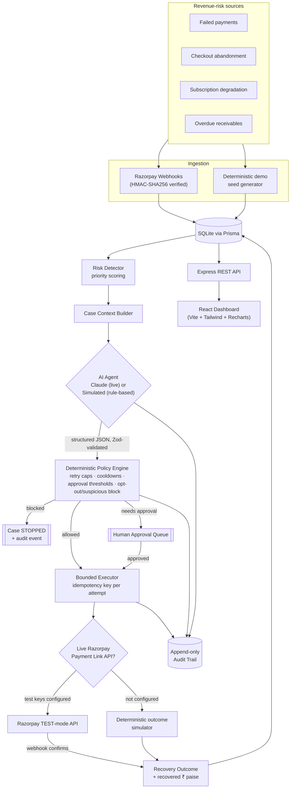
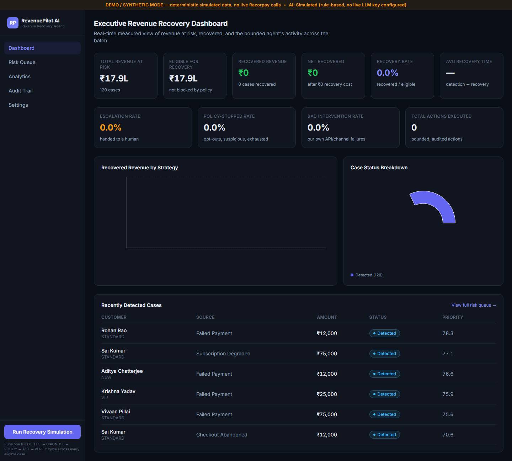
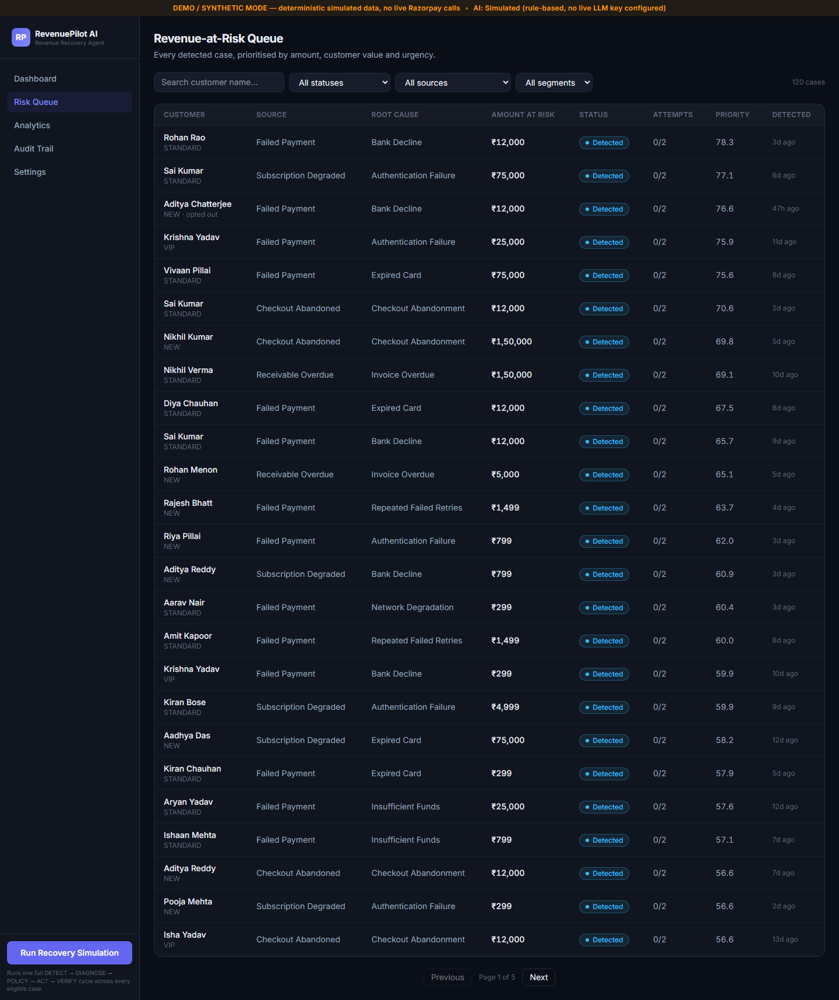
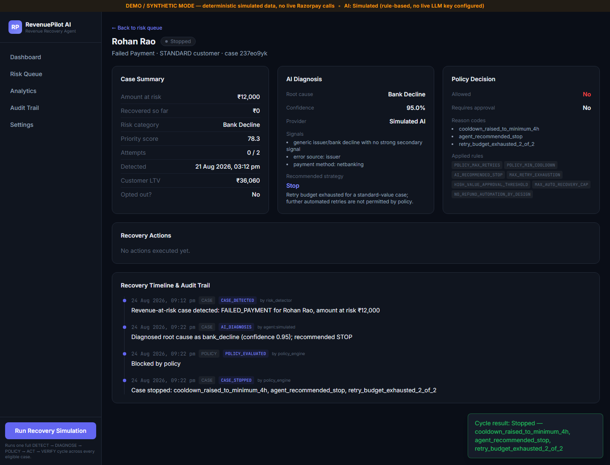
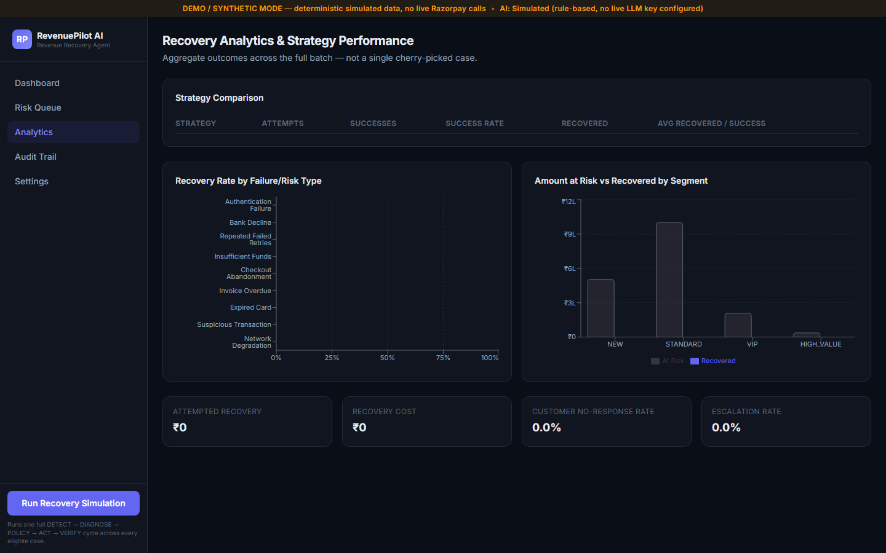
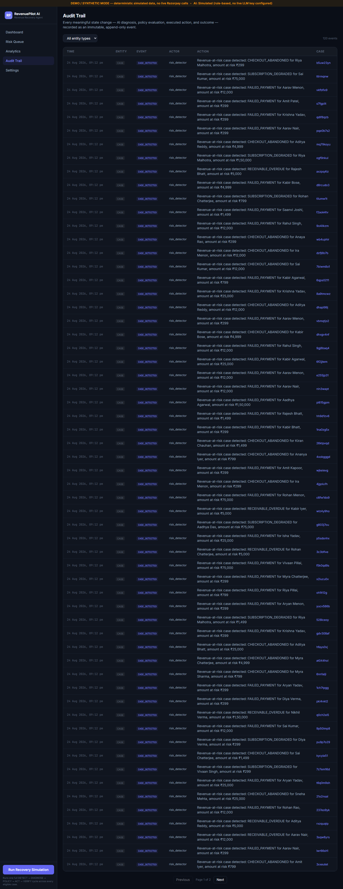
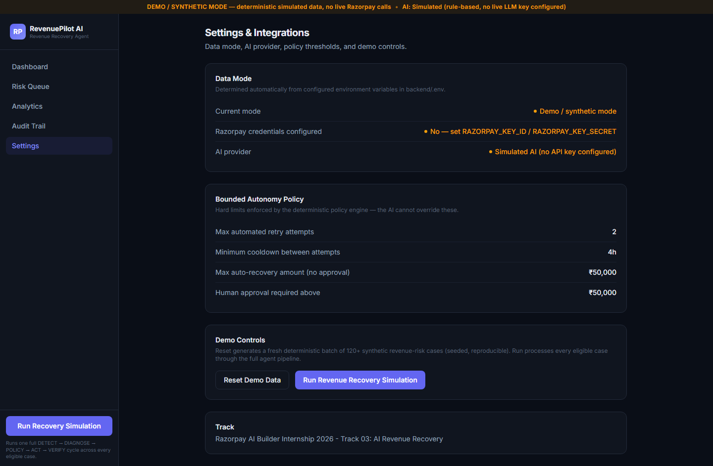

# RevenuePilot AI

**A bounded, auditable revenue-recovery agent for Razorpay merchants — it detects money slipping away, diagnoses why, chooses a compliant recovery action, executes it safely, and measures exactly how much came back.**

Built for the **Razorpay AI Builder Internship 2026 — Track 03: AI Revenue Recovery**.

> *"Don't just identify the problem. Show measured money recovered across a batch, with compliant escalation, stopping rules, and an audit trail."*

---

## Table of contents

1. [Problem](#problem)
2. [Why it matters](#why-it-matters)
3. [Solution](#solution)
4. [Architecture](#architecture)
5. [Agent workflow](#agent-workflow)
6. [Razorpay integration](#razorpay-integration)
7. [AI architecture](#ai-architecture)
8. [Safety & bounded autonomy](#safety--bounded-autonomy)
9. [Demo instructions](#demo-instructions)
10. [Environment variables](#environment-variables)
11. [Installation](#installation)
12. [Running locally](#running-locally)
13. [Running tests](#running-tests)
14. [Demo scenarios](#demo-scenarios)
15. [Metrics](#metrics)
16. [Screenshots](#screenshots)
17. [Limitations](#limitations)
18. [Future roadmap](#future-roadmap)

---

## Problem

Every Indian payments merchant leaks revenue in three quiet ways:

- **Failed payments** — bank declines, expired cards, OTP failures, temporary issuer outages. Most are never retried at all, or retried blindly without understanding *why* they failed.
- **Checkout abandonment** — a customer starts paying and never finishes. No one follows up, or everyone gets the same generic reminder regardless of context.
- **Overdue B2B receivables** — invoices that quietly age past due with no structured chaser process, until someone notices months later.

None of this is exotic fraud. It is ordinary, high-volume, low-drama leakage — which is exactly why it is under-instrumented: no single failure looks urgent, but the sum is a meaningful fraction of GMV.

## Why it matters

Recovering this revenue is *not* the same problem as detecting it. A system that blindly retries every failed card is worse than doing nothing — it annoys customers, wastes gateway calls, and can violate payment-network retry rules. A system that escalates everything to a human doesn't scale. The right system:

- diagnoses the *actual* reason a payment is at risk before choosing what to do,
- picks a **bounded, appropriate** intervention (not "retry forever"),
- knows when to **stop** — opted-out customers, suspicious transactions, exhausted retries,
- routes **high-value or ambiguous cases to a human**,
- and can prove, after the fact, exactly what it did and why.

## Solution

**RevenuePilot AI** runs a closed loop over every revenue-risk case:

```
DETECT → UNDERSTAND → DECIDE → ACT → VERIFY → RECOVER / STOP / ESCALATE → MEASURE
```

- **Detection** is deterministic code reading real payment/receivable/checkout state — not an LLM guess.
- **Understanding** (root-cause diagnosis) is an AI step, grounded only in the facts given to it, always returning a structured, schema-validated decision — never free text that could trigger money movement.
- **Deciding what's allowed** is a separate, deterministic **policy engine** that bounds retries, cooldowns, and auto-recovery amounts, and forces human approval above configured thresholds — the AI recommends, the policy engine authorizes.
- **Acting** goes through a bounded executor with idempotency keys, so duplicate triggers (a retried webhook, a duplicate demo run) can never cause a duplicate financial action.
- **Verifying and measuring** is 100% integer-paise arithmetic in deterministic code — the AI is never allowed to compute a final money value.
- Every step writes an **append-only audit event**, so any case can be replayed end-to-end: payment failure → AI diagnosis → strategy selection → policy validation → recovery action → outcome → recovered revenue.

## Architecture



**Stack**: React + TypeScript + Vite + Tailwind CSS v4 + Recharts (frontend) · Node.js + TypeScript + Express (backend) · SQLite + Prisma ORM · Zod validation · Anthropic Claude API (optional) · Vitest (unit/integration) + Playwright (E2E).

Full data model, sequence diagrams and the failure-handling design are in [`docs/architecture.md`](docs/architecture.md). API reference is in [`docs/api.md`](docs/api.md).

## Agent workflow

For every case, one cycle (`runRecoveryCycle`, [`backend/src/strategy/executor.ts`](backend/src/strategy/executor.ts)) does, in order:

1. **Skip if not eligible** — case already terminal, awaiting approval, or still in cooldown (`nextEligibleAt`).
2. **Build context** — deterministic code assembles amount at risk, customer segment/opt-out/suspicious flags, prior attempts, recent merchant-wide failure rate, and a weak heuristic root-cause hint.
3. **Diagnose** — the AI agent (Claude if configured, otherwise a deterministic rule-based simulator) returns a structured decision: root cause, confidence, signals, recommended strategy, expected recovery probability/amount, proposed max attempts & cooldown, stopping conditions, escalation condition, compliance notes. Validated against a Zod schema before anything downstream sees it.
4. **Authorize** — the deterministic policy engine (`backend/src/policy/engine.ts`) caps attempts/cooldown to configured ceilings, blocks opted-out/suspicious cases and AI-recommended stops outright, and forces human approval above the amount thresholds or for escalations. It can never be more permissive than the AI recommended, only more restrictive.
5. **Act** — the bounded executor creates one `RecoveryAction` row keyed by `caseId:strategy:attemptNumber` (a DB-unique idempotency key), executes the channel (a real Razorpay Payment Link in TEST mode, or the deterministic simulator in DEMO mode), and handles the three possible outcomes: success, no-recovery, or an upstream API failure — each with its own audit event and state transition.
6. **Verify & measure** — recovered amount, recovery cost, and time-to-recovery are computed in integer paise by deterministic code and written to `RecoveryOutcome`.

Every step above writes to the audit trail — see the **Recovery Timeline & Audit Trail** panel on any case detail page.

## Razorpay integration

Researched against the current official Razorpay docs (Orders, Payments, Payment Links, Webhooks) before implementation. What's actually implemented, real SDK calls, in `backend/src/razorpay/`:

| Capability | API used | Where |
|---|---|---|
| Recovery payment link | `POST /payment_links` (Razorpay Node SDK `paymentLink.create`) | [`client.ts`](backend/src/razorpay/client.ts) |
| Payment link status | `GET /payment_links/:id` | [`client.ts`](backend/src/razorpay/client.ts) |
| Order creation | `POST /orders` | [`client.ts`](backend/src/razorpay/client.ts) |
| Payment fetch | `GET /payments/:id` | [`client.ts`](backend/src/razorpay/client.ts) |
| Webhook signature verification | HMAC-SHA256 over the **raw** body, `X-Razorpay-Signature` header | [`signature.ts`](backend/src/razorpay/signature.ts) |
| Webhook ingestion | `payment_link.paid`, `payment.captured`, `payment.failed`, `order.paid` | [`routes/webhooks.ts`](backend/src/routes/webhooks.ts) |

**Why payment links, not silent re-charges**: Razorpay's Payments API is retrieval/capture-only — a merchant cannot silently re-debit a customer's saved card without a mandate. The compliant "retry" for a card/UPI/netbanking failure is a fresh Razorpay-hosted Payment Link the customer completes themselves, which is what every retry-family strategy (`SMART_RETRY`, `DELAYED_RETRY`, `PAYMENT_LINK`, `ALT_METHOD`) does under the hood in TEST mode.

**Local webhook testing**: `POST /webhooks/razorpay/simulate` (disabled outside development) runs a payload through the exact same HMAC-verification and event-handling pipeline as the real endpoint, without needing a public HTTPS tunnel.

**Idempotency**: `WebhookEvent.razorpayEventId` has a unique DB constraint — Razorpay's documented at-least-once redelivery on non-2xx responses is a guaranteed no-op on replay.

## AI architecture

- **Deterministic code owns**: money math (integer paise only, see `backend/src/lib/money.ts`), eligibility/cooldown/retry-limit checks, policy authorization, state transitions, audit logging, and every aggregate metric.
- **AI owns**: root-cause interpretation and strategy *recommendation* only, always returned through a forced tool call (`submit_recovery_decision`) validated against a Zod schema (`backend/src/ai/schema.ts`) before use. See [`claudeProvider.ts`](backend/src/ai/claudeProvider.ts).
- **No API key configured?** The exact same schema is satisfied by a deterministic, rule-based reasoning engine ([`simulated.ts`](backend/src/ai/simulated.ts)) that encodes real domain heuristics (issuer-decline recency, retry exhaustion, receivable ageing, customer value) — not a stub. The UI and every audit event honestly label which provider produced a given decision (`"provider": "claude" | "simulated"`), and a live call that errors or fails schema validation **falls back to simulated rather than crashing the case**, recorded as `degraded: true`.
- The AI is architecturally incapable of executing a financial action: `runAgent()` returns a recommendation object; only `evaluatePolicy()` + `executeApprovedStrategy()`, both pure deterministic code, can move a case toward execution.

## Safety & bounded autonomy

Enforced in [`backend/src/policy/engine.ts`](backend/src/policy/engine.ts), independent of what the AI recommends:

| Rule | Effect |
|---|---|
| `POLICY_MAX_RETRIES` (default 2) | AI-requested attempt count is capped, never trusted directly |
| `POLICY_MIN_COOLDOWN_HOURS` (default 4h) | AI-requested cooldown is raised to this floor |
| Customer opted out | Case blocked outright, regardless of AI recommendation |
| Suspicious transaction | Case blocked outright, routed to manual compliance review |
| AI recommends `STOP` | Case blocked outright |
| Retry budget exhausted | Blocked unless the strategy is `ESCALATION` or `RECEIVABLE_FOLLOWUP` |
| Amount ≥ `POLICY_APPROVAL_THRESHOLD_PAISE` (default ₹50,000) | Requires human approval before execution |
| Expected recovery > `POLICY_MAX_AUTO_RECOVERY_PAISE` | Requires human approval |
| Strategy is `ESCALATION` | Always requires human approval |
| Refund-type reversals | Structurally unreachable — not present in the strategy catalog at all |

Every evaluation writes a `PolicyDecision` row and an audit event listing every rule applied and every reason code fired, visible on the case detail page. High-value/escalated cases sit in `AWAITING_APPROVAL` until a merchant operator approves or rejects them from the UI (`POST /api/recovery/cases/:id/approve`).

**Failure handling**: a fixed slice of demo executions deterministically simulate an upstream API failure (`SIMULATED_GATEWAY_TIMEOUT`) independent of customer behaviour, so the bounded-retry-then-escalate path is always exercised, not hidden. See `handleApiFailure()` in [`executor.ts`](backend/src/strategy/executor.ts): first failure → exponential-backoff bounded retry; retries exhausted → automatic escalation to human review, with a full audit trail either way.

## Demo instructions

1. Start both servers (see [Running locally](#running-locally)).
2. Open `http://localhost:5173`. The top banner honestly states the current mode (`DEMO / SYNTHETIC` or `RAZORPAY TEST`) and AI provider.
3. Click **Run Recovery Simulation** (sidebar, or Settings page) — this is the one-click batch demo. It calls `POST /api/demo/run`, which processes every eligible case through the full DETECT→DIAGNOSE→POLICY→ACT→VERIFY pipeline with real database writes (not a UI animation).
4. Watch the Dashboard KPIs, Analytics charts, and Audit Trail update with real numbers.
5. Open any case from the Risk Queue to see its individual diagnosis, policy decision, actions, and full timeline.
6. **Settings → Reset Demo Data** regenerates a fresh, deterministic 120-case batch (same seed → same data, reproducibly) if you want to demo from a clean slate again.

## Environment variables

See [`.env.example`](.env.example) for the authoritative list. Nothing is required — every value defaults to DEMO/SYNTHETIC mode:

| Variable | Purpose | If unset |
|---|---|---|
| `RAZORPAY_KEY_ID` / `RAZORPAY_KEY_SECRET` | Razorpay TEST-mode API credentials | DEMO mode: deterministic simulator instead of live API calls |
| `RAZORPAY_WEBHOOK_SECRET` | Verifies inbound webhook signatures | Real webhooks rejected (401); `/webhooks/razorpay/simulate` still works locally |
| `ANTHROPIC_API_KEY` | Live Claude root-cause/strategy calls | Deterministic simulated AI engine used instead, clearly labelled everywhere |
| `POLICY_MAX_RETRIES`, `POLICY_MIN_COOLDOWN_HOURS`, `POLICY_MAX_AUTO_RECOVERY_PAISE`, `POLICY_APPROVAL_THRESHOLD_PAISE` | Bounded-autonomy thresholds | Sensible defaults (2 retries, 4h cooldown, ₹50,000 auto-cap/approval) |
| `DEMO_SEED`, `DEMO_CASE_COUNT` | Deterministic demo dataset | `revenuepilot-2026`, 120 cases |

## Installation

Requires Node.js 20+.

```bash
git clone <this-repo-url>
cd razorpay-revenuepilot-ai

cp .env.example backend/.env      # optional: fill in real Razorpay/Anthropic keys

cd backend && npm install && npx prisma db push && npm run db:seed
cd ../frontend && npm install
cd ../tests && npm install && npx playwright install chromium   # optional, for E2E
```

## Running locally

```bash
# Terminal 1
cd backend && npm run dev      # http://localhost:4000

# Terminal 2
cd frontend && npm run dev     # http://localhost:5173 (proxies /api to :4000)
```

Re-seed at any time with `cd backend && npm run db:reset`.

## Running tests

```bash
# Backend unit + integration tests (money math, policy rules, priority scoring,
# simulated AI schema conformance, and a real concurrent-duplicate-trigger
# idempotency test against SQLite via Prisma)
cd backend && npm run typecheck && npm test

# Frontend typecheck + production build
cd frontend && npm run build

# End-to-end (requires both dev servers running — see above)
cd tests && npm test
```

All of the above were run against this exact codebase; results are summarized in [Metrics](#metrics) and the final submission report.

## Demo scenarios

- **Successful recovery** — a failed-payment case diagnosed as `temporary_issuer_failure`, strategy `DELAYED_RETRY`, policy-allowed, executed, customer completes payment → case `RECOVERED`, full audit trail.
- **Policy-blocked** — an opted-out customer or a suspicious-transaction case is blocked before any contact is attempted, regardless of what the AI recommended.
- **Human-in-the-loop** — a ≥₹50,000 case is diagnosed and strategy-selected, then held `AWAITING_APPROVAL` until a merchant operator approves or rejects it from the Case Detail page.
- **Bounded failure handling** — a case whose recovery-channel call deterministically fails with a simulated gateway timeout: first failure schedules an exponential-backoff retry; if retries are exhausted, the case auto-escalates to human review — all audit-logged.
- **Duplicate-trigger protection** — verified by an automated test that fires two concurrent execution requests for the same case/attempt and asserts exactly one `RecoveryAction` row and one audit event exist (`backend/src/__tests__/executorIdempotency.test.ts`).

## Metrics

Numbers below are from an actual `POST /api/demo/run` batch over the seeded 120-case dataset (`DEMO_SEED=revenuepilot-2026`) in this repository — reproduce them yourself with **Settings → Reset Demo Data → Run Revenue Recovery Simulation**, or `GET /api/analytics` after a run. Because the simulator is seeded, re-running the same seed reproduces the same figures.

| Metric | Definition |
|---|---|
| Total Revenue At Risk | Sum of `amountAtRiskPaise` across all cases |
| Recovered Revenue | Sum actually recovered (integer paise, deterministic) |
| Recovery Rate | Recovered ÷ Eligible (policy-unblocked) revenue |
| Net Recovered Revenue | Recovered − modelled recovery cost (2% of recovered amount) |
| Escalation Rate | Cases handed to a human ÷ total cases |
| Bad Intervention Rate | Actions that failed due to **our own** channel/API error ÷ total actions (excludes ordinary customer non-response) |

Live values are always visible on the Dashboard and Analytics pages — see [Screenshots](#screenshots) for a captured example run, and the final submission report for the exact figures from the run used in the pitch video.

## Screenshots

| Executive Dashboard | Risk Queue |
|---|---|
|  |  |

| Case Detail (after running a cycle) | Analytics & Strategy Performance |
|---|---|
|  |  |

| Audit Trail | Settings & Bounded Policy |
|---|---|
|  |  |

## Limitations

- **Synthetic demo data by default.** Without real Razorpay TEST credentials, all cases come from a deterministic synthetic generator, clearly labelled `DEMO / SYNTHETIC MODE` everywhere in the UI. The Razorpay integration layer is real and immediately usable — it has not been exercised against a live Razorpay test account in this submission because no credentials were available in the build environment.
- **No live LLM calls in this submission's default run.** No `ANTHROPIC_API_KEY` was available in the build environment; all AI decisions in the shipped demo come from the deterministic simulated engine, honestly labelled. The Claude integration path is implemented and typechecked but not exercised against the live API here.
- **Messaging channels (SMS/email) are simulated**, not wired to a real provider (e.g. Twilio, SendGrid) — Razorpay's own Payment Link `notify` flag is used for the one channel that *is* real (the link itself); reminder/follow-up "sends" are logged and audited but do not dispatch a real message in this submission.
- **Single-merchant demo.** The data model supports multiple merchants; the seed script and UI currently drive one demo merchant.
- **SQLite, not PostgreSQL**, for the demo — chosen for zero-friction local setup. The Prisma schema has no SQLite-specific modeling choices that would block a `postgresql` datasource swap.
- **Recovery cost is a simple 2%-of-recovered model**, not integrated with real messaging/gateway billing.

## Future roadmap

- Wire a real SMS/email provider for the reminder/receivable-chaser channels.
- Exercise and record a live Razorpay TEST-mode run end-to-end once credentials are available.
- Add a subscription/mandate-retry-sequencer strategy against Razorpay Subscriptions.
- Promise-to-pay tracking for the B2B receivables chaser (currently a single structured follow-up sequence).
- Multi-merchant auth and per-merchant policy configuration from the UI instead of environment variables.
- PostgreSQL deployment target + hosted demo.
