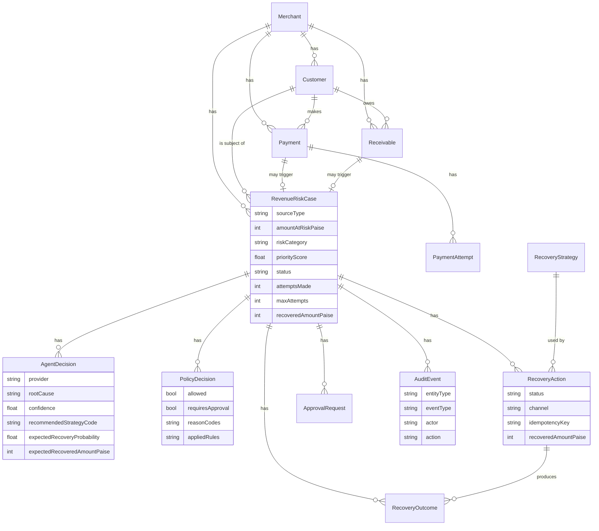
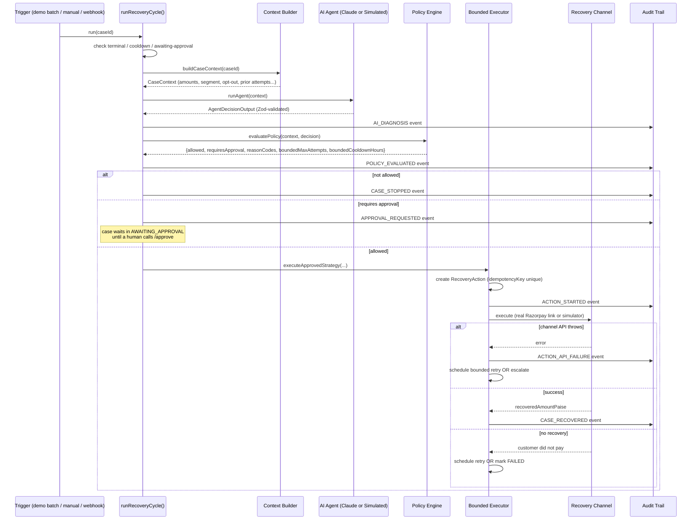
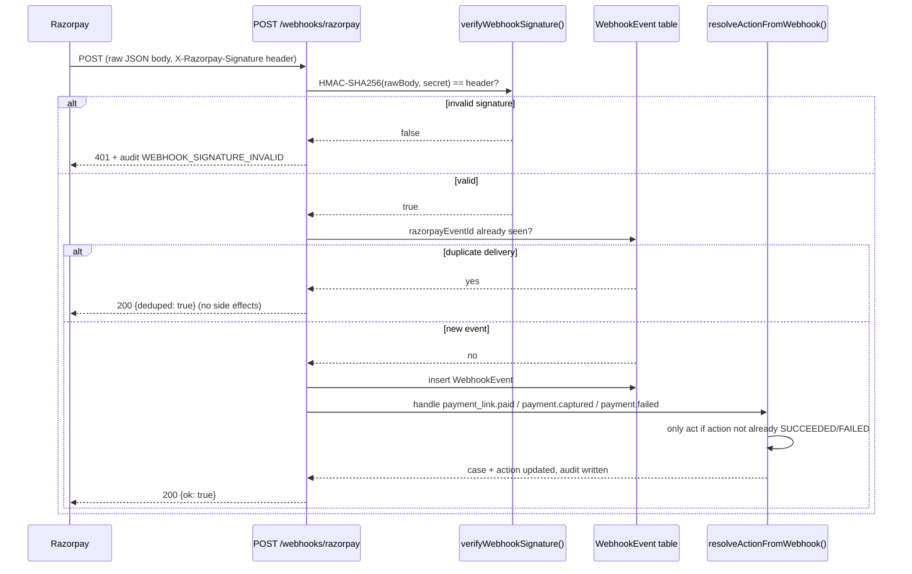

# Architecture

## System overview

RevenuePilot AI is a conventional three-tier web app (React SPA → Express REST API → SQLite via Prisma) with one added component: a bounded agent pipeline that turns a detected revenue-risk case into a recovery action. See the top-level diagram in the [README](../README.md#architecture).

The design principle that shapes every module boundary: **the AI recommends, deterministic code decides and acts.** Nothing the LLM (or its simulated stand-in) returns is trusted directly — it is schema-validated, then re-evaluated by a separate policy engine that can only ever be *more* restrictive than what the AI proposed, never less.

## Data model

Full field-level definitions: [`backend/prisma/schema.prisma`](../backend/prisma/schema.prisma).

## Agent cycle sequence

## Webhook ingestion flow

A local simulator (`POST /webhooks/razorpay/simulate`, disabled in production) builds a real HMAC signature and runs the identical pipeline, so the ingestion logic is exercised without a public HTTPS tunnel.

## Failure handling

Section 15/16 of the brief requires a visible, gracefully-handled failure. This is implemented, not merely described:

- In DEMO mode, `simulateChannelExecution()` ([`backend/src/razorpay/demoSimulator.ts`](../backend/src/razorpay/demoSimulator.ts)) deterministically (seeded by `caseId:attemptNumber:strategy`) returns an `API_ERROR` outcome for ~6% of executions — modelling a gateway timeout independent of customer behaviour, so this path is always present in a demo batch, not cherry-picked.
- In RAZORPAY_TEST mode, any thrown error from the real `paymentLink.create()` call takes the identical path.
- `handleApiFailure()` in [`executor.ts`](../backend/src/strategy/executor.ts):
  1. Marks the `RecoveryAction` `FAILED` with a `failureCode`, writes an `ACTION_API_FAILURE` audit event.
  2. If attempts remain, schedules a bounded retry with **exponential backoff** (`cooldownHours * 2^(attemptNumber-1)`), moves the case back to `STRATEGY_SELECTED`.
  3. If attempts are exhausted, creates an `ApprovalRequest`, moves the case to `ESCALATED`, writes an audit event — a human takes it from there.
- Distinguishing this from an ordinary "customer didn't pay" outcome matters for metrics: `badInterventionRate` (Analytics) counts only *our own* channel failures, not normal customer non-response, which is tracked separately as `customerNoResponseRate`.

## Idempotency & safety

- **Duplicate action protection**: `RecoveryAction.idempotencyKey` (`caseId:strategyCode:attemptNumber`) is a DB-unique constraint. Two concurrent triggers for the same attempt race to insert; the loser catches a Prisma `P2002` and returns a "duplicate suppressed" result instead of creating a second action. Verified by an automated concurrency test (`backend/src/__tests__/executorIdempotency.test.ts`).
- **Duplicate webhook protection**: `WebhookEvent.razorpayEventId` unique constraint — Razorpay's documented retry-on-non-2xx redelivery is a no-op.
- **Cooldown / eligibility gating**: `RevenueRiskCase.nextEligibleAt` prevents a case from being re-processed before its bounded cooldown elapses, checked at the top of every cycle.
- **State machine**: case `status` only moves through the documented set (`DETECTED → DIAGNOSED → STRATEGY_SELECTED/AWAITING_APPROVAL → ACTION_IN_PROGRESS → RECOVERED/PARTIALLY_RECOVERED/FAILED/ESCALATED/STOPPED`) — terminal statuses (`RECOVERED`, `STOPPED`, `ESCALATED`) are checked and short-circuit any further cycle.
- **Money safety**: every amount is an integer count of paise from creation to display; `backend/src/lib/money.ts` is the only place arithmetic on money happens, and it is covered by unit tests.

## Security model

- Secrets only ever come from environment variables (`backend/src/lib/env.ts`); `.env` is git-ignored, `.env.example` documents every variable with no real values.
- `helmet()` sets standard security headers; `cors()` is restricted to the configured frontend origin; `express-rate-limit` caps request volume per IP.
- Webhook signature verification uses `crypto.timingSafeEqual` (not `===`) to avoid timing side-channels.
- All request inputs are parsed and validated with Zod before touching the database (`backend/src/routes/*.ts`).
- Error responses never leak internal error messages/stack traces when `NODE_ENV=production` (`backend/src/middleware/errorHandler.ts`).
